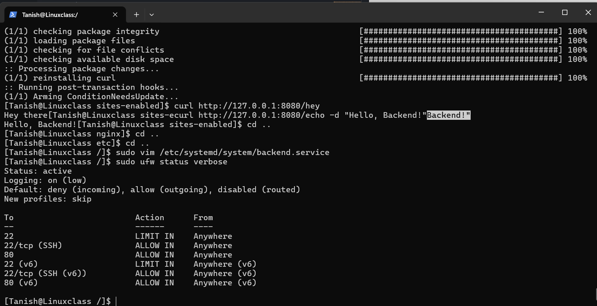
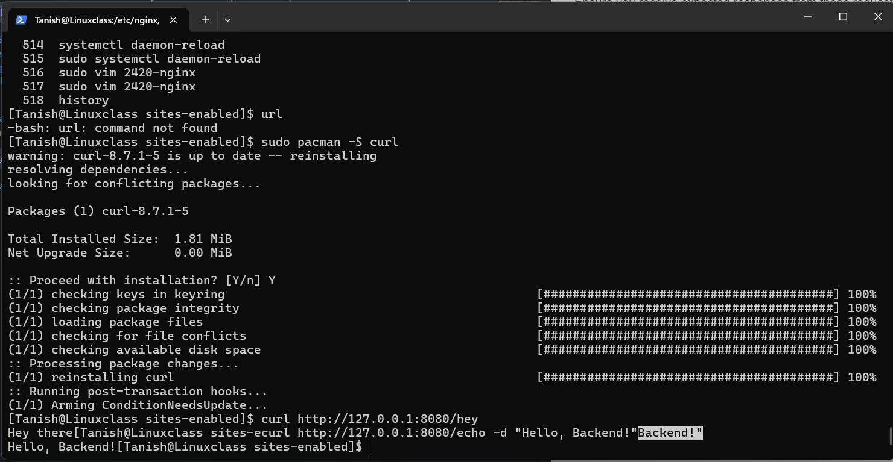
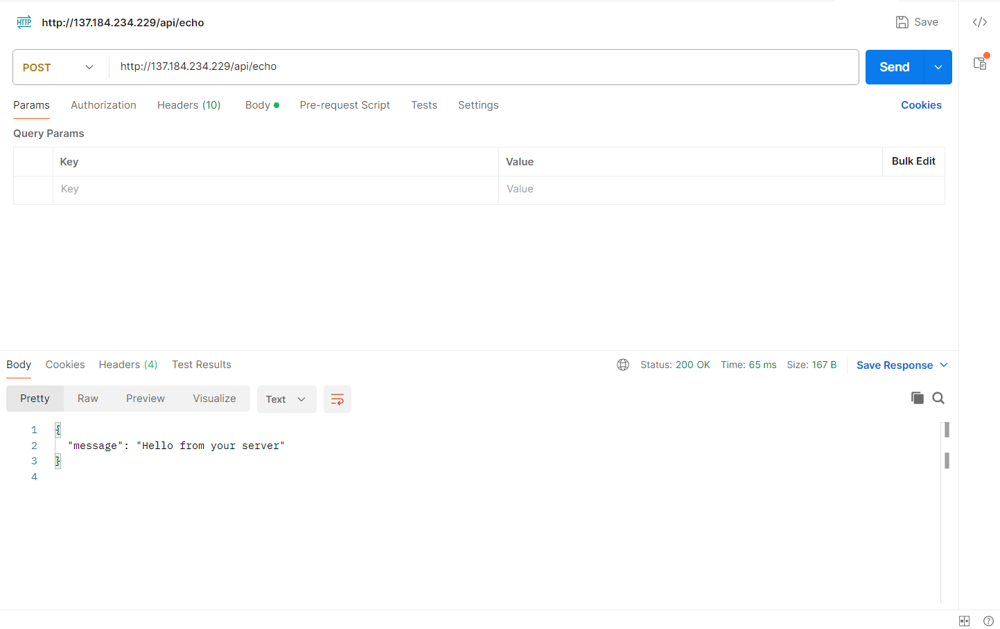
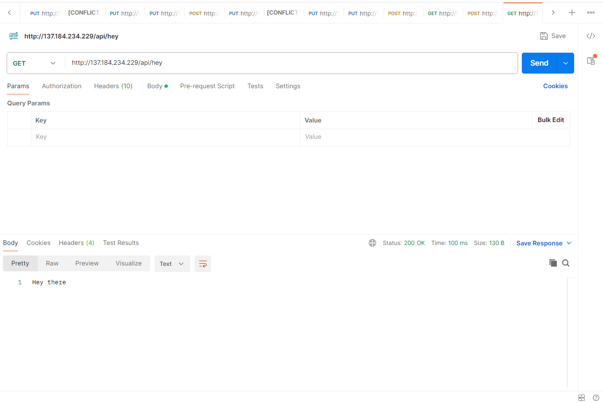

## Tutorial: Adding Firewall (UFW) and Reverse Proxy with NGINX

In this tutorial, we'll extend the setup from Assignment 3p1 by adding a firewall using UFW (Uncomplicated Firewall) and configuring NGINX as a reverse proxy server to connect to our backend service. 

### Prerequisites

Before you begin, ensure you have completed Assignment 3p1 setup:

- NGINX is installed and configured to serve your ip.

### Step 1: Set Up Firewall (UFW)

The primary use case for a firewall is security. Firewalls can intercept incoming malicious traffic before it reaches the network, as well as prevent sensitive information from leaving the network

UFW is a program that makes it a little easier to manage a netfilter firewall. UFW actually manages nftables or iptables, which make use of netfilter which is part of the Linux kernel.

1. **Install UFW (if not already installed):**

```bash
   sudo pacman -Syu
   sudo pacman -S ufw
```

2. **Allow SSH and enable UFW:** To make things easier for us, we are going to allow ssh from anywhere.

```bash
   sudo ufw allow SSH
```

3. **Allow access to specific ports (80 for HTTP):** Since we are creating a web server we also want to allow http connections

```bash
   sudo ufw allow 80/tcp
```

Now we have defined some rules for our firewall, but we haven't turned it on yet. We can turn our firewall on with this command:

```bash
sudo ufw enable
```

4. **Verify the firewall settings:**We can check the status of ufw with the command

```bash
   sudo ufw status verbose
```

### Step 2: Configure NGINX as a Reverse Proxy

1. **Edit NGINX Configuration:**

Modify your NGINX server block configuration (found in `/etc/nginx/sites-enabled/2420-nginx.conf`).
For this assignment we are goinng to use the server  block conffigured in Assignment 3 part 1.

```bash
sudo vim /etc/nginx/sites-enabled/2420-nginx.conf
```

Now Edit  the file and make changes to the server block. The Final result should look similar to the server block below.

```nginx
   server {
       listen 80;
       server_name your_server_ip;
      location / {
        # First attempt to serve request as file, then
        # as directory, then fall back to displaying a 404.
        try_files $uri $uri/ =404;
      }

       location /api/ {
           proxy_pass http://127.0.0.1:8080;
           proxy_set_header Host $host;
           proxy_set_header X-Real-IP $remote_addr;
           proxy_set_header X-Forwarded-For $proxy_add_x_forwarded_for;
           proxy_set_header X-Forwarded-Proto $scheme;
       }
   }
```

**Note:** Replace `your_server_ip` with the actual  ip address  of your Arch server.

2. **Test NGINX Configuration:**

Ensure the NGINX configuration is valid:

```bash
   sudo nginx -t
```

3. **Reload NGINX:**

```bash
   sudo systemctl reload nginx
```

### Step 3: Create Backend Connection

1. **Transfer the Binary to Your Server:**

   Use `sftp` (secure copy) or another file transfer method to upload the `hello-server` binary to your server. Replace `<local_path_to_backend>` with the path to your local `backend` binary and `<remote_server_address>` with your server's address:

Now we are going to make directory to store the binary file:

```bash
sudo mkdir /opt/backend
```

Then we are going to move the  binary file to this directory.

```bash
sudo mv hello-server /opt/backend
```

Replace `hello-server` and `/opt/backend/directory`, and with your specific binary file name and path you wish to choose.

1. **Create the Service File:**

Use a text editor to create a new systemd service file for your backend (`backend.service`). For example:

```bash
   sudo vim /etc/systemd/system/backend.service
```

You can't change this path

2. **Add Service Configuration:**

   Inside the service file, add the following configuration (adjust `WorkingDirectory` and `ExecStart` paths as needed):

   ```ini
   [Unit]
   Description=Backend Service
   After=network.target

   [Service]
   Type=Simple
   WorkingDirectory=/opt/backend
   ExecStart=/path/to/backend/binary
   Restart=always

   [Install]
   WantedBy=multi-user.target
   ```

**Note:** Adjust `WorkingDirectory` and `ExecStart` paths as needed
Replace `your_username`, `your_group`, `/opt/backend/directory`, and `/opt/backend/hello-server` with your specific details and paths.
This is a systemd unit file, which is used to define and control services in a Linux system.

1. **[Unit]**
   - This section contains metadata about the unit.
   - `Description`: Describes what the unit does. In this case, it's a backend service.
   - `After=network.target`: Specifies that this service should start after the network is up.

2. **[Service]**

- This section contains configuration options for the service itself.
- `WorkingDirectory=/opt/backend`: Specifies the working directory for the service. This is where the service will run from. Adjust this path according to your setup.
- `ExecStart=/path/to/backend/binary`: Specifies the command to start the service. You should replace `/path/to/backend/binary` with the actual path to the backend binary.
- `Restart=always`: Specifies that the service should be restarted automatically if it exits unexpectedly.

3. **[Install]**

- This section specifies how the unit should be installed.
- `WantedBy=multi-user.target`: Specifies the target that this unit should be enabled under. `multi-user.target` is typically used for services that should be started in multi-user mode.

In summary, this unit file defines a backend service that should run as a specific user and group, with the specified working directory and command to start the service. It also ensures that the service is started after the network is up and that it's automatically restarted if it exits unexpectedly. Finally, it specifies that the service should be enabled under `multi-user.target`.

1. **Reload Systemd and Start the Service:**

After creating the service file, reload systemd to recognize the new service:

```bash
   sudo systemctl daemon-reload
```

   Then, start the backend service:

```bash
   sudo systemctl start backend
```

   Check the status to ensure it's running without errors:

```bash
   sudo systemctl status backend
```

   Enable the service to start on boot:

```bash
   sudo systemctl enable backend
```

### Step 3: Test Connecting to Your Backend

1. **Test Backend Routes:**

   Use `curl` or a similar tool to test the backend routes. As the backend is running on `127.0.0.1:8080`, try accessing the `/hey` and `/echo` routes:

   ```bash
   curl http://127.0.0.1:8080/hey
   curl http://127.0.0.1:8080/echo -d "Hello, Backend!"
   ```

If you dont have the utility you can install it by `sudo pacman -S curl`
Ensure you receive expected responses from these requests.

### Step 4: Access Backend via NGINX

1. **Access Backend via NGINX:**

   Open a web browser and navigate to `http://your_domain.com`. NGINX should now proxy requests to your backend service.
   Use `curl` or a similar tool to test the routes. Try accessing the `/hey` and `/echo` routes:

   ```bash
   curl http://your_domain.com/api/hey
   curl http://your_domain.com/api/echo -d "Hello, Backend!"
   ```

If you set up server name earlier to just the server ip address, then

   ```bash
   curl http://your_server_ip/api/hey
   curl http://your_server_ip/api/echo -d "Hello, Backend!"
   ```

### Screenshots

Include screenshots demonstrating:

- UFW status (`sudo ufw status verbose`)
- 
- Successful backend route tests (`curl` commands)

- Browser access to backend via NGINX (`http://your_domain.com`)
  Via postman
  The post request for echo
  
  The Get request For hey


### Conclusion

By completing these steps, you've added a firewall (UFW) to secure your server and configured NGINX as a reverse proxy to connect to your backend service. This setup allows external access to your backend through NGINX, enhancing security and flexibility in your web application architecture.